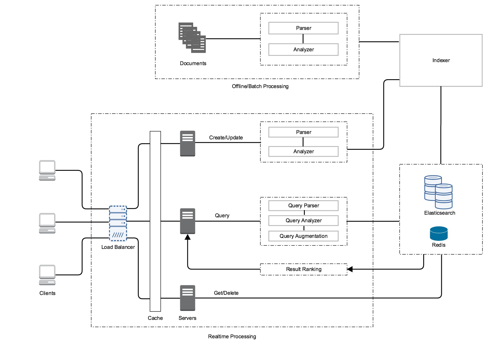
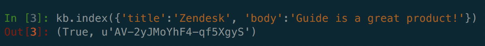
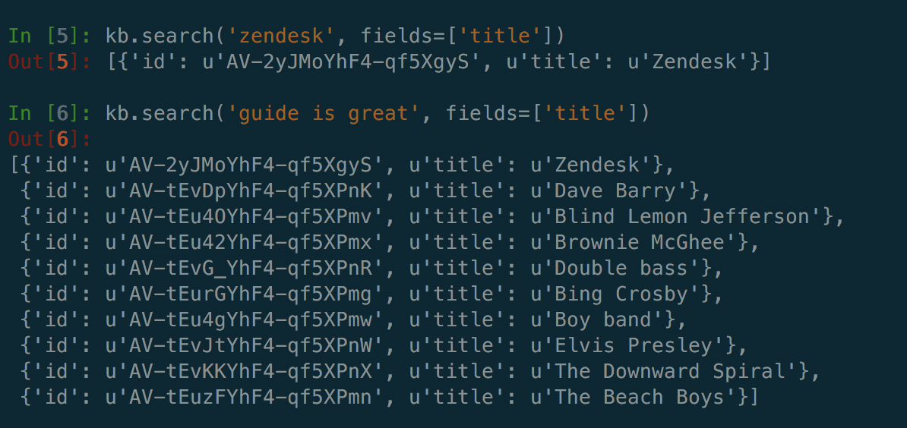

# Knowledge Base

Implements a pretty straightforward (and basic) search system.

The following serves as documentation for the different components in the system and how they can be scaled to handle higher volume.

## System Architecture

This image details the high level system architecture for a search system as described in the problem statement.



Conceptually, the system is divided into two parts:

### Offline Processing

This part is responsible for batch processing documents for indexing. Usually, this step is used to initialize storage, or update a major chunk of them periodically. I envision a distributed processing system such as **_Spark_** or **_Hadoop_** used to implement this part. The job would directly communicate with the Indexer to write to storage in bulk.

### Realtime Processing

This is the crux of the system and provides the user with querying ability in addition to standard CRUD functionality. Since our system is geared towards accessing and searching documents more than other operations (creating/updating), a distributed datastore such as Elasticsearch seems ideal. More reasons to motivate Elasticsearch as the choice of database will follow in later sections.

The servers interacting with the various backend processes are supplied with a caching layer to speed up response times. Also, to ensure some level of fault tolerance as well as ease of horizontal scaling, a Load balancer is used to distribute work between the servers.

The above described search system can be decomposed further into the following major components: Indexer, Query Engine (and Ranker), Storage. The following sections describe each component and their sub components. 

## Indexer

The indexer is responsible for preparing documents for storage. The purpose of this component is to store documents in a way that facilitates easy searching.

The documents to be indexed are passed through several preprocessing steps to distill and extract additional information from them. These generally include **_parsing_** the text, **_tokenizing_** it, and processing it by performing tasks such as removing **_stop words_**, **_stemming_**, **_lemmatizing_**, and so on. At this point, each document is represented by a processed bag of tokens. 

These tokens are then stored in a structure known as an **_Inverted Index_**. This index maps each token to a list of Ids of documents that contain the token. In addition to just storing the Id, other information such as the position of the token in the document and the weight of the term in the document (such as the **_Tf-idf_** score) can be stored in the list as well. 

The indexer also creates and stores word vectors for the documents to help with relevance scoring at query time. These will be described in the next section dealing with queries. 

In the accompanying code, the responsibilities of processing and indexing the document are shared by Elasticsearch. Elasticsearch provides a bunch of predefined analyzers that can be used to process text before indexing. In this case, the Standard analyzer is used which tokenizes text on white space and removes stop words. The documents are indexed in inverted indices where each indexed field has its own index. 

The fields **_title_** and **_body_** are analyzed while indexing whereas the field **_locale_** is stored as it is (not analyzed). This is done with the assumption that it'll be used as a filter and thus would require to be matched against exactly.

## Query Engine

The query engine is the heart of the search engine and provides an interface to perform free text queries against the document store.

Query text is usually parsed and analyzed in the same way as documents to be indexed to ensure consistency. It is sometimes enhanced to include tokens that were not a part of the original query based on how relevant we need the results to be and in other situations such as handling ambiguous search terms. In such cases tokens that help better define the context of the terms such as **_synonyms_** are added to the query before the actual search takes place. Other NLP techniques such as **_word sense disambiguation_** can be a part of this step as well.

To explain how queries are handled, the concept of word vectors needs to be described. A word vector can be imagined to be a long binary array, with length equal to the number of unique tokens across all documents. Each element in this array represents one token in the corpus. For each document we construct such an array, where we set an element to a non zero value (usually the weight of the term for the document) if the corresponding token is present in the current document, and 0 otherwise.

These arrays essentially represent vectors in **_n_** dimensional space (where _n_ is the number of unique words) and we can gauge how similar two documents are by taking the **_dot product_** between their corresponding vectors.

With this information, searching becomes pretty straightforward. When a user enters some text to search against our storage, we parse and analyze it (usually using the same analyzers that were used for indexing) and create a word vector for the queried text. At the same time, we use the tokens to retrieve document ids in our storage which contain the query terms using the inverted indices we created. We can then infer the **_similarity score_** between the query vector and the document vectors and arrange the results based on this score.

In the code, the responsibility of querying is also abstracted by Elasticsearch. It uses the Standard analyzer as described earlier to process the query text. It is built on the Lucene search engine and uses word vectors for relevancy scoring.

### Ranking

We can change how the results are sorted based on additional scoring factors. For example, after retrieving the relevant documents, we can enhance the vector similarity score by giving weight to things like how many times a document was viewed or whether a particular query term appears in a specific field. In this case, the final score of a document, _D_, given an array of factors, _F_: [f0, f1, ... , fn] and the corresponding weights for the factors, _W_: [w0, w1, ... , wn] becomes:

 ```Dscore = W'F```
 
where, sum(_W_) = 1.0. The component responsible for sorting and ranking is collectively known as the **Ranking** module. 

In the code, we weight the documents higher if the query terms are also found in the title. However, after retrieving the relevant documents, we use the view counts for the documents to perform a secondary sort. Finally this list is returned as the results shown to the user. One way to avoid this additional step would be to store the view counts with the document in Elasticsearch. Ranking the documents would then be as simple as asking Elasticsearch to sort of this field. However, I decided to forego this for performance issues as described in the Storage section. 

## Storage

This component provides the means for enabling all the operations described in the sections above. It is responsible for storing the datastructures that the Indexer produces, and is also responsible for providing low latency access to records to the Query Engine.

An important issue while designing a search system is the problem of dealing with scale. Despite best measures to compress data, it can often grow beyond what one machine can handle. In such cases, the data must be split, or **_sharded_**, between multiple instances. The most common strategy is to hash the data and use some property of the hashed value to decide which shard to store that piece of information on. It is usually good practice to store data that is normally accessed together on the same shard.

Again, Elasticsearch encapsulates the storage in our system. It is a distributed hashed database and uses sharding schemes behind the scenes to enable horizontal scaling when required.

We could store the view counts as a field of the document and increment it everytime an article is accessed, but that would mean reindexing the document again each time (even partial updates fully reindex the document). To avoid this, I introduced an in memory key value store (Redis) which takes care of storing and retrieving the view count for the ranking module. In doing so, the onus of handling continuous reindexing is lifted from Elasticsearch and instead is handled by Redis, which is optimized for random writes and access.

## Miscellaneous

I tested the provided code using dockered instances of Elasticsearch and Redis. I indexed approximately 1000 articles from Wikipedia under the category **_Musical_Groups_**. Provided below are some screenshots of the code in action:

_Initializing a Knowledge Base object_


_Indexing a document_



_Accessing a document_


_Searching_



_Deleting an indexed document_


